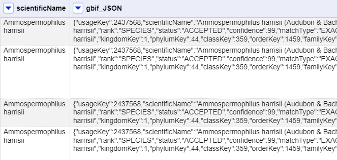
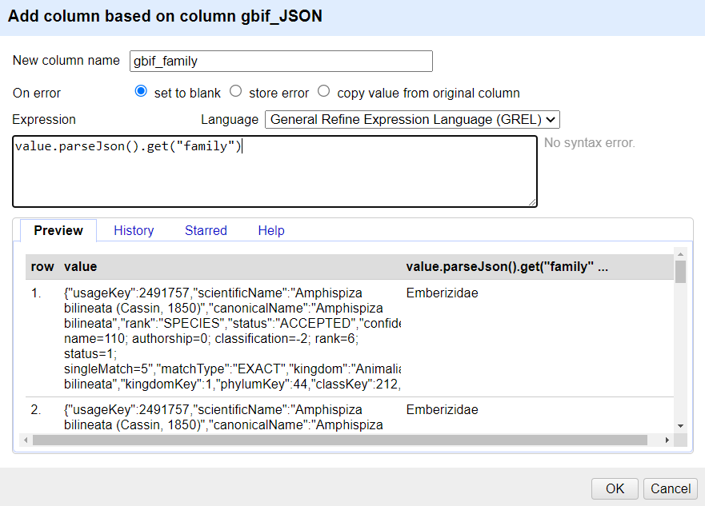

::::::::::::::::::::::::::::::::::::::: objectives

- Use URLs to fetch data from the web based on columns in an OpenRefine project
- Add columns to parse JSON data returned by web services

::::::::::::::::::::::::::::::::::::::::::::::::::

:::::::::::::::::::::::::::::::::::::::: questions

- How do I fetch data from an Application Programming Interface (API) to be used in OpenRefine?
- How do I reconcile my data by comparing it to authoritative datasets

::::::::::::::::::::::::::::::::::::::::::::::::::

## Looking up data from a URL

OpenRefine can retrieve data from URLs. This can be used in various ways, including looking up additional information from a remote service, based on information in your OpenRefine data. As an example, you can look up the scientific names in a dataset against the taxonomy of the Global Biodiversity Information Facility (GBIF), and retrieve additional information such as higher taxonomy and identifiers.

Typically this is a two step process, firstly a step to retrieve data from a remote service, and secondly to extract the relevant information from the data you have retrieved.

To retrieve data from an external source, use the drop down menu at any column heading and select `Edit column` > `Add column by fetching URLs...`.

This will prompt you for a GREL expression to create a URL. This URL will use existing values in your data to build a query. When the query runs OpenRefine will request each URL (for each line) and retrieve whatever data is returned (this may often be structured data, but could be HTML). The data retrieved will be stored in a cell in the new column that has been added to the project. You can then use OpenRefine transformations to extract relevant information from the data that has been retrieved. Two specific OpenRefine functions used for this are:

- `parseHtml()`
- `parseJson()`

The `parseHtml()` function can also be used to extract data from XML.

### Retrieving higher taxonomy from GBIF

In this case we are going to use the [GBIF API](https://www.gbif.org/developer/summary). Note that API providers may impose rate limits or have other requirements for using their data, so it's important to check the site's documentation. To reduce the impact on the service, use a value of `500` in the `Throttle Delay` setting to specify the number of milliseconds between requests.

The syntax for requesting species information from GBIF is `http://api.gbif.org/v1/species/match?name={name}` where {name} is replaced with the scientific name in the dataset.

- Using the dropdown menu of `scientificName`, select `Edit column` > `Add column by fetching URLs...`

- In the `New column name` field, enter "gbif\_JSON"

- In the field for `Throttle delay` enter 500

- In the expression box type the GREL `"http://api.gbif.org/v1/species/match?name="+escape(value,'url')`
  
  At this point, your screen should be similar to this:
  
  {alt='Add column by fetching URLs screen capture'}

- Click 'OK'

You should see a message at the top on the OpenRefine screen indicating it is fetching some data, with progress showing the percentage of the proportion of rows of data successfully being fetched. Wait for this to complete.

At this point you should have a new column containing a long text string in a format called 'JSON' (this stands for JavaScript Object Notation, although very rarely spelt out in full). The results should look like this figure:

{alt='Example of the results of fetching data from GBIF'}

OpenRefine has a function for extracting data from JSON (sometimes referred to as 'parsing' the JSON). The `parseJson()` function is explained in more detail at the [Format-based functions page](https://docs.openrefine.org/manual/grelfunctions/#format-based-functions-json-html-xml).

- In the new column you've just added use the dropdown menu to access `Edit column` > `Add column based on this column...`

- Add the new column name: "gbif\_family"

- In the Expression box type the GREL `value.parseJson().get("family")`

- You should see in the Preview the taxonomic family of the scientific names displays, similar to this screen:
  
  {alt='Parse JSON to extract taxonomic family'}

The reason for using `Add column based on this column` is that this allows you to retain the full JSON and extract further data from it if you need to. If you only wanted the taxonomic family and did not need any other information from the JSON you could use `Edit cells` > `Transform...` with the same GREL expression.

:::::::::::::::::::::::::::::::::::::::: keypoints

- OpenRefine can look up custom URLs to fetch data based on what's in an OpenRefine project
- Such API calls can be custom built

::::::::::::::::::::::::::::::::::::::::::::::::::

