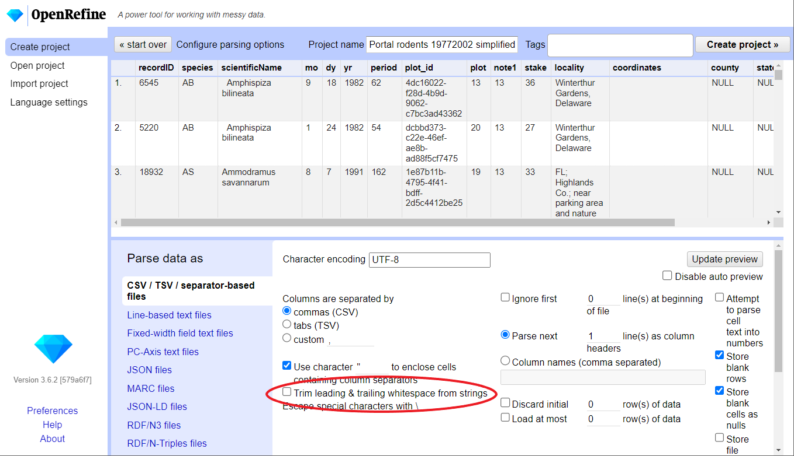

## Importing data

>## What kinds of data files can I import?
>There are several options for getting your data set into OpenRefine. You can import files in a variety of formats including:
>
> * Comma-separated values (CSV) or tab-separated values (TSV)
> * Text files
> * Fixed-width columns
> * JSON
> * XML
> * OpenDocument spreadsheet (ODS)
> * Excel spreadsheet (XLS or XLSX)
> * RDF data (JSON-LD, N3, N-Triples, Turtle, RDF/XML)
> * Wikitext
>
> See the [Create a project by importing data](https://docs.openrefine.org/manual/starting#create-a-project-by-importing-data) page for more information.
{: .callout}

## Create your first OpenRefine project (using provided data)

Start OpenRefine, which will open in your browser (at the address http://127.0.0.0:3333). Once OpenRefine is launched in your
browser, the left margin has options to:

  * `Create Project`
  * `Open Project`
  * `Import Project`
  * `Language Settings`

  

1. Click `Create Project` from the left margin and select then `This Computer` (because you're uploading data from your computer).  
1. Click `Choose Files` and browse to where you stored the file `Portal_rodents_19772002_simplified.csv`. Select the
   file and click `Open`, or just double-click on the filename.
1. Click `Next>>` under the browse button to upload the data into OpenRefine.  
1. On the next screen, OpenRefine will present you with a preview of your data. You can check here for obvious errors, if, for example, your file was tab-delimited rather than comma-delimited, the preview would look strange (and you could correct it by choosing the correct separator and clicking the `Update Preview` button on the right. If you selected the wrong file, click `<<Start Over` at the top left.

    

1. In the middle of the page, will be a set of options (`Character encoding`, etc.). Make sure the tick box next to `Trim leading & trailing whitespace from strings` is not ticked. (We're going to need the leading whitespace in one of our examples.)
1. If all looks well, click `Create Project>>` in the top right. You will be presented with a view onto your data. This is OpenRefine!

> ## OpenRefine does not modify your original dataset
> Once your data is imported into a project - OpenRefine leaves your raw data intact and works on a copy which it creates
> inside the newly created project. All the data transformation and cleaning steps you apply will be performed on this copy
> and you can easily undo any changes too.
{: .callout}
