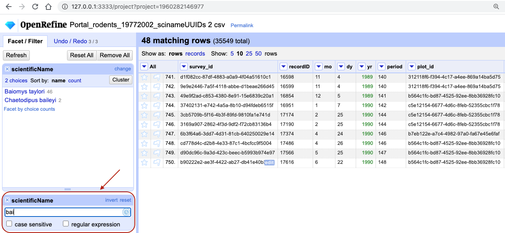

## Filtering data

Sometimes you want to view and work only with a subset of data or apply an operation only to a subset. 
You can do this by applying various filters to your data.

### Including/excluding data entries on facets

One way to filter down our data is to use the `include` or `exclude` buttons on the entries in a text facet. 
If you still
have your text facet for `scientificName`, you can use it. If you've closed that facet, recreate it by selecting `Facet` >
`Text facet` on the `scientificName` column. 

1. In the text facet, hover over one of the names, e.g. `Baiomys taylori`. Notice that when you hover over it, there are
   buttons to the right for `edit` and `include`.
2. Whilst hovering over `Baiomys taylori`, move to the right and click the `include` option. This will include this
   species, as signified by the name of the species changing from blue to orange, and new options of `edit` and
   `exclude` will be presented. Note that in the top of the page, "46 matching rows" is now displayed instead of "35549
   rows".
3. You can include other species in your current filter - e.g. click on`Chaetodipus baileyi` in the same way to include it in the filter.
4. Alternatively, you can click the name of the species to include it in the filter instead of clicking the 
`include`/`exclude` buttons. This will include the selected species and exclude all others options in a single step, which can be useful.
5. Click `include` and `exclude` on the other species and notice how the entries appear and
   disappear from the data table to the right.

You can also filter data using other types of facets - let's do it as an exercise.

> ## Exercise
> Remove all current facets and recreate the scatterplot facet for `recordID` and `period` columns as before. 
> Drag a rectangular selection anywhere on the `Scatterplot Matrix` square for `recordID` and `period`. 
> Notice how the filtered data change to show only entries included in the rectangle.
>
> > ## Solution
> > In the screenshot below, we have filtered out only 12 entries by dragging a small rectangular selection on the 
> > scatterplot graph. As before, when we first introduced the scatterplot facet, we can notice that something is
> > potentially wrong with our data as values for `period` in the filtered subset 
> > are negative (we are expecting only positive values) and potentially require futher examination and cleaning.
> >
>   
> >
> {: .solution}
{: .challenge}

### Text filters
Another way to filter data is to create a text filter on a column. Close all facets you may have created previously 
and reinstate the text facet on the `scientificName` column.

1. Click the down arrow next to `scientificName` > `Text filter`. A `scientificName` filter will appear on the left margin below the text facet.
2. Type in `bai` into the text box in the filter and press return. At the top of the page it will report that, out of the 35549
   rows in the raw data, there are 48 rows in which the text has been found within the `scientificName` column (and these rows will be selected for the
   subsequent steps).

   

3. Near the top of the screen, change `Show:` to 50. This way, you will see all the matching rows in a single page.

> ## Exercise
>
> 1. What scientific names are selected by this text filter?
> 2. How would you restrict it to one of the species selected?
>
> > ## Solution
> > 1. If you kept a text facet over `scientificName` from before - it will show that
> > two names match your filter criteria are: `Baiomys taylori` and `Chaetodipus baileyi`. If you have closed
> > the text facet, select `Facet` > `Text facet` on the `scientificName` column to reinstate it.
> > 2. There are various options to restrict to only one of the two species identified. You could make the search case sensitive.
> > You could split the `scientificName` column into species and genus columns, as before, and filter only the column of interest.
> > You could include more letters in your filter, e.g. `baio` which would exclude `Chaetodipus baileyi`. Try playing with these different options.
> > You could include more letters in your filter, e.g. `baio` which would exclude `Chaetodipus baileyi`. Try playing with these different options.
> >
> {: .solution}
{: .challenge}

**Important:** Make sure both species are included in your filtered dataset before continuing with the rest of the exercises.

>## Filters vs. facets
> Faceting and filtering look very similar. A good distinction is that faceting gives you an overview of all the data that
> is currently selected, while filtering allows you to select a subset of your data for further inspection and analysis.
>
{: .callout}

## Sorting data
Sorting data is a useful practice for detecting outliers in data - potential errors and blanks 
will sort to the top or the bottom of your data. 

To sort the data in a column, click the arrow next to your chosen column name and select `Sort...`. This will open a pop-up
that will present you with different options, e.g. whether you wish to sort by `text`, `numbers`, `dates` or `booleans` 
(i.e. `TRUE` or `FALSE` values). Additional options will appear to allow you to fine-tune your sorting - e.g. you can 
specify where to place Blanks and Errors in the sorted results.

> ## Exercise
>
> Try sorting the data by month using the column `mo`. What happens if you sort the column as text? How can you ensure that months are in order? 
> > ## Solution  
> > From the drop-down menu on the column `mo` select `Sort` then `Sort...`. Select 
> > `Sort cell values as text` first. (Note that you can rearrange `Errors`, `Blanks` and `Valid values` so that errors and blanks
> > will sort to the top. This is a good practice detect some outliers.)      
> >
>   
> >
> > You will notice that values for month have been sorted in alphabetical order, where months 10, 11 and 12 came before month 2. 
> >
>   
> >  
> > This is probably not what you wanted - so you will have to redo the sort and select the `Sort cell values as number` option.
> > 
> > You may have noticed that in the case of sorting as numbers, the actual column itself remained as text. OpenRefine
> > did not convert the column to numbers (notice the absence of the green font). 
> > 
> > Another thing to note is that sorting is not an action that you can undo/redo - it does not appear on Undo/Redo tab.
> > This is because sorting only rearranges the order of the data, it doesn't change its content. This means 
> > the sorting will not change the cells in a column from text to numbers - rather, it will interpret the
> > values as numbers for the purposes of sorting, but will keep the underlying data type unchanged.
> {: .solution}
{: .challenge}

The first time you sort a column, the first option will present as `Sort...`. If you re-sort a column that you
have already sorted, the drop-down menu changes slightly: the first option will be `Sort` and the following sub-options
will be presented:

* `Sort...` - This option enables you to choose a new sort. 
* `Reverse` - This option allows you to reverse the order of the sort.
* `Remove sort` - This option allows you to undo your sort.

It may not always be that obvious in OpenRefine that you performed a sort. Once you complete the sort for the first time
a `Sort` button will appear at the top of the page as an indicator that the data has been sorted. It will disappear if
you remove the sort.

 
 
> ## Exercise
> 
> Remove the sort by month. Make sure you still have the text filter for the text "bai" on the `scientificName` column present 
> (if you have lost your text filter for "bai" see the start of the episode to help you reinstate it). Then sort the data by `plot`. In which year(s) were observations recorded for plot 1 in the
> filtered dataset? 
> 
> > ## Solution
> > From the drop-down menu on the column `plot` select `Sort...` then `Sort cell values as numbers` and `smallest first`. 
> > The years observations were recorded in plot 1 are 1990 and 1995.
> > 
> {: .solution}
{: .challenge}

### Sorting by multiple columns

Once you have completed one sort, any further sort will be performed by default as an additional sort. For example, if
you take the data that has been sorted by `plot` and the sort by `year`, OpenRefine will present the data sorted by
`plot` and then by `year`. If you wish to restart the sorting process, check the `sort by this column
alone` box in the `Sort` pop-up menu.

> ## Exercise
>
> You might like to look for trends in your data by month of collection across years.     
> 1. How do you sort your data by month?   
> 2. How would you do this differently if you were instead trying to see all of your entries in chronological order?  
> 
> > ## Solution
> > 
> > 1. To sort by month, click on `Sort...` from the `mo` column, and then select `Sort cell values as numbers`. 
> > This will group all entries made in, for example, January,
> > together, regardless of which year that entry was collected.  
> > 2. To sort chronologically, click on `Sort` > `Sort...` from the `yr` column , and then select 
> > `Sort cell values as numbers`. Before
> > clicking 'OK' make sure you select `sort by this column alone` to start a new sort from scratch. 
> > 3. You can now apply
> > an additional sort, this time by month (click on `Sort` from the `mo` column, and then select 
> > `Sort cell values as numbers`). 
> > 4. To ensure
> > that all entries are shown chronologically, you will need to add a third sorting step to sort data by day (using the column `dy`). 
> > 
> {: .solution}  
{: .challenge}

If you go back to one of the already sorted columns and select `Sort` > `Remove sort`, that column is removed from
your multiple sort. If it is the only column sorted, then the data revert to their original order.

> ## Exercise
>
> Sort by `year`, `month` and `day` in some order. Be creative: try sorting as `numbers` or `text`, and in reverse order
> (`largest to smallest` or `z to a`).
>
> Use `Sort` > `Remove sort` to remove the sort on the second of three columns. Notice how that changes the order.
{: .challenge}

>## Sorting does not change data
> You may have noticed that after any of the sorting steps there was nothing to undo/redo. This is because you have only 
> reordered and not modified you data. If you want to revert to the original order of the data - make sure you remove all
> "sorts" using the `Sort` > `Remove sort` option. 
{: .callout}
