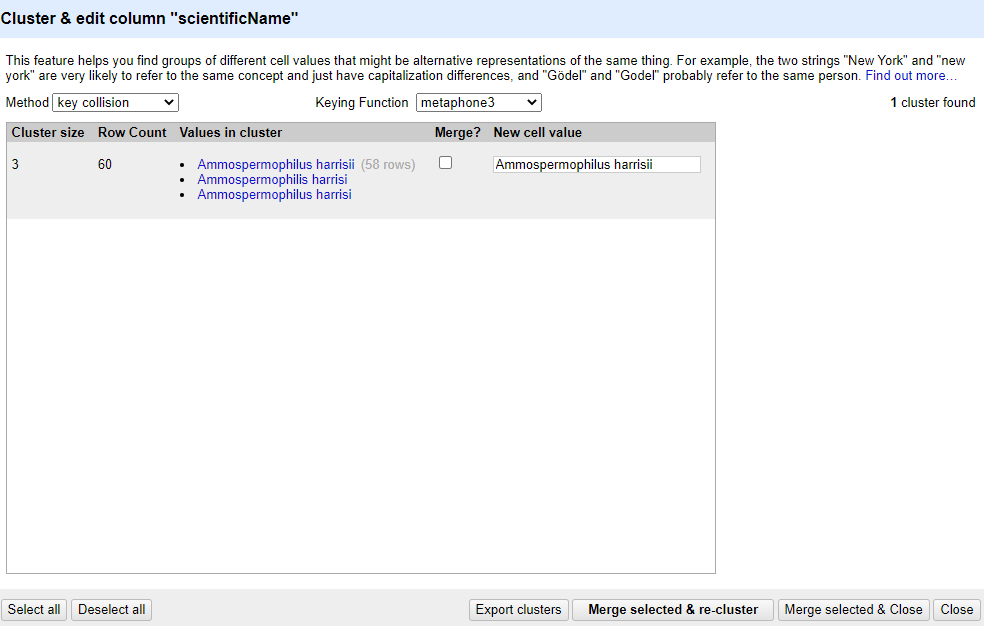

## Data splitting

It is easy to split data from one column into multiple columns if the parts are separated by a common separator (say a comma, or a space).

1. Let us suppose we want to split the `scientificName` column into separate columns, one for genus and one for species.
2. Click the down arrow next to the `scientificName` column. Choose `Edit Column` > `Split into several columns...`
3. In the pop-up, in the `Separator` box, replace the comma with a space (the box will look empty when you're done).
4. Important! Uncheck the box that says `Remove this column`.
5. Click `OK`. You should get some new columns called `scientificName 1`, `scientificName 2`, `scientificName 3`, and `scientificName 4`.
6. Notice that in some cases these newly created columns are empty (you can check by text faceting the column). Why? What do you think we can do to fix it?

The entries that have data in `scientificName 3` and `scientificName 4` but not the first two `scientificName` columns had an extra space at the beginning of the entry. Leading and trailing white spaces are very difficult to notice when cleaning data
manually. This is another advantage of using OpenRefine to clean your data - this process can be automated.

In newer versions of OpenRefine (from version 3.4.1) there is now an option to
clean leading and trailing white spaces from all data when importing the data initially and creating the project.

## Undoing / Redoing actions

It is common while exploring and cleaning a dataset to make a mistake or decide to change the order of the process you wish to conduct. OpenRefine provides `Undo` and `Redo` operations to make it easy to roll back your changes.

1. Click `Undo / Redo` in the left side of the screen. All the changes you have made will appear in the left-hand panel.
   The current stage in the data processing is highlighted in blue (i.e. step 4. in the screenshot below). As you click
   on the different stages in the process, the step identified in blue will change and, far more importantly, the data
   will revert to that stage in the processing.

   

1. We want to undo the splitting of the column `scientificName`. Select the stage just
   before the split occurred and the new `scientificName` columns will disappear.
1. Notice that you can still click on the last stage and make the columns reappear, and toggle back and forth between these states. You can also select the state more than one steps back and revert to that state.
1. Let's leave the dataset in the state before `scientificNames` was split.

## Trimming leading and trailing whitespace

Words with spaces at the beginning or end are particularly hard for humans to identify from strings without these spaces (as we have seen with the `scientificName` column). However, blank spaces can make a big difference to computers, so we usually want to remove them.

1. In the header for the column `scientificName`, choose `Edit cells` > `Common transforms` > `Trim leading and trailing whitespace`.
2. Notice that the `Split` step has now disappeared from the `Undo / Redo` pane on the left and is replaced with a `Text transform on 2 cells`

> ## Exercise
> Repeat the splitting of column `scientificName` exercise after trimming the whitespace.
> > ## Solution
> >
> > On the `scientificName` column, click the down arrow next to the `scientificName` column and
> > choose `Edit Column` > `Split into several columns...` from the drop down menu. Use a blank character as a separator,
> > as before. You should now get only two columns `scientificName 1` and `scientificName 2`.
> {: .solution}
{: .challenge}

## Renaming columns

We now have the genus and species parts neatly separated into 2 columns - `scientificName 1` and `scientificName 2`.
We want to rename these as `genus` and `species`, respectively.
1. Let's first rename the `scientificName 1` column. On the column, click the down arrow and then `Edit column` > `Rename this column`.
3. Type "genus" into the box that appears.

> ## Exercise
>
> Try to change the name of the `scientificName 2` column to `species`. What problem do you encounter? How can you fix the problem?
>
> > ## Solution
> >
> > 1. On the `scientificName 2` column, click the down arrow and then `Edit column` > `Rename this column`.
> > 1. Type "species" into the box that appears.
> > 1. A pop-up will appear that says `Another column already named species`. This is because there is another column with the same name where we've recorded the species abbreviation.
> > 1. You can use another name for the `scientificName 2` or change the name of the `species` column and then rename the `scientificName 2` column.
> {: .solution}
{: .challenge}

Edit the name of the `species` column to `species_abbreviation`. Then, rename `scientificName 2` to `species`.

## Data clustering

Clustering allows you to find groups of entries that are not identical but are
sufficiently similar that they may be alternative representations of the same thing (term or data value).
For example, the two strings `New York` and `new york` are very likely to refer to the same concept and just have a
capitalization differences. Likewise, `Björk` and `Bjork` probably refer to the same person. These kinds of variations
occur a lot in scientific data. Clustering gives us a tool to resolve them.

OpenRefine provides different clustering algorithms. The best way to understand how they work is to experiment with them.

The dataset has several near-identical entries in `scientificName`. For example, there are two misspellings of *Ammospermophilus harrisii*:

 * *Ammospermophilis harrisi* and
 * *Ammospermophilus harrisi*

1. If you removed it, reinstate the `scientificName` text facet (you can also remove all the other facets to gain some space).
In the `scientificName` text facet box - click the `Cluster` button.
1. In the resulting pop-up window, you can change the `Method` and the `Keying Function`. Try different combinations to see what different mergers of values are suggested.
1. If you select the `key collision` method and the `metaphone3` keying function. It should identify one cluster:

   

1. Note that the `New Cell Value` column displays the new name that will replace the value in all the cells in the
group. You can change this if you wish to choose a different value than the suggested one.
1. Tick the `Merge?` checkbox beside each group, then click `Merge selected & Close` to apply the corrections to the dataset and close the window.
1. The text facet of `scientificName` will update to show the new summary of the column. It will have now 7 options:

   

> ## Clustering Documentation
> Full documentation on clustering can be found at the [OpenRefine Clustering Methods In-depth](https://docs.openrefine.org/next/technical-reference/clustering-in-depth) page.
{: .callout}
