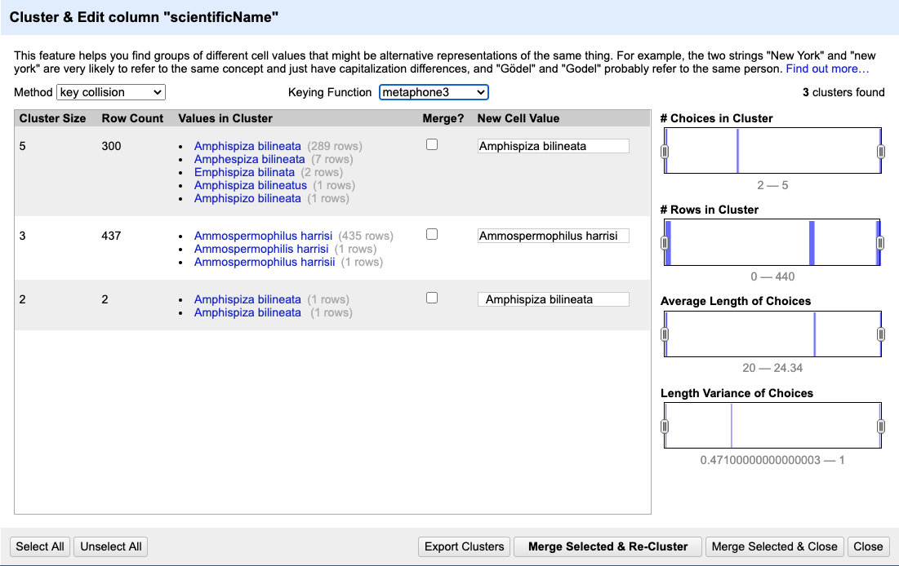

So far we have learned to use various facets to inspect and explore our data. Text facet
also allowed us to directly edit a subset of data in bulk. OpenRefine offers a number of
other functionalities to transform and restructure the data.

## Numbers

When a table is imported into OpenRefine, all columns are treated as having text values. We saw earlier how we can sort column values as numbers, but this does not change the cells in a column from text to numbers. Rather, this interprets the values as numbers for the purposes of sorting but keeps the underlying data type as is. We can, however, transform columns to other data types (e.g. number or date) using the `Edit cells` > `Common transforms` feature. Here we will experiment changing columns to numbers and see what additional capabilities that grants us.

Be sure to remove any `Text filter` facets you have enabled from the left panel so that we can examine our whole dataset. You can remove an existing facet by clicking the `x` in the upper left of that facet window.

To transform cells in the `recordID` column to numbers, click the down arrow for that column, then `Edit cells` > `Common transforms…` > `To number`. You will notice the `recordID` values change from left-justified to right-justified, and black to green color.

> ## Exercise
>
> Transform three more columns, including `period`, from text to numbers. Can all columns be transformed to numbers?
>
> > ## Solution
> >
> > Only observations that include only numerals (0-9) can be transformed to numbers. If you apply a number transformation to
> > a column that doesn't meet this criteria, and then click the `Undo / Redo` tab, you will see a step that starts with
> > `Text transform on 0 cells`. This means that the data in that column was not transformed.
> >
> {: .solution}
{: .challenge}

### Numeric facet
Sometimes there are non-number values or blanks in a column which may represent errors in data entry and we want to find them.
We can do that with a `Numeric facet`.

> ## Exercise
>
> 1. For a column you transformed to numbers, edit one or two cells, replacing the numbers with text (such as `abc`) or blank (no number or text).
> 2. Use the pulldown menu to apply a numeric facet to the column you edited. The facet will appear in the left panel.
> 3. Notice that there are several checkboxes in this facet: `Numeric`, `Non-numeric`, `Blank`, and `Error`. Below these are counts of the number of cells in each category. You should see checks for `Non-numeric` and `Blank` if you changed some values.
> 4. Experiment with checking or unchecking these boxes to select subsets of your data.
{: .challenge}

When done examining the numeric data, remove this facet by clicking the `x` in the upper left corner of its panel. Note that this does not undo the edits you made to the cells in this column. If you want to reverse these edits, use the `Undo / Redo` function.

## Scatterplot facet

Now that we have multiple columns representing numbers, we can see how they relate to one another using the scatterplot facet. Select a numeric column, for example `recordID`, and use the pulldown menu to > `Facet` > `Scatterplot facet`. A new window called `Scatterplot Matrix` will appear. There are squares for each pair of numeric columns organized in an upper right triangle. Each square has little dots for the cell values from each row.

> ## Exercise
>
> 1. Examine the scatterplots overall. Do the patterns make sense?
> 2. Why does the scatterplot for `recordID` vs `period` have the pattern it does?
{: .challenge}

## Examine pair of columns in detail

We can examine one pair of columns by clicking on its square in the `Scatterplot Matrix` A new facet with only that pair will appear in the left margin.

> ## Exercise
>
> Click in the scatterplot facet in the left margin and drag to highlight a rectangle. This will subset the data to those entries.
{: .challenge}

> ## Exercise
>
> - Click on the `Scatterplot Matrix` square for `recordID` and `period` to get that as a facet in the left margin.
> - Redo the `Text filter` on `scientificName` to show only entries including the letters `bai`.
> Notice the change in the scatterplot. It might be easier to see if you click `export plot` to put it on a new browser tab.
{: .challenge}

## Data clustering

Clustering allows you to find groups of entries that are are not identical but are
sufficiently similar that they may be alternative representations of the same thing (term or data value).
For example, the two strings `New York` and `new york` are very likely to refer to the same concept and just have a
capitalisation differences. Likewise, `Björk` and `Bjork` probably refer to the same person. These kinds of variations
occur a lot in scientific data. Clustering gives us a tool to resolve them.

OpenRefine provides different clustering algorithms. The best way to understand how they work is to experiment with
them.

1. If you removed it, reinstate the `scientificName` text facet (you can also remove all the other facets to gain some space).
In the `scientificName` text facet box - click the `Cluster` button.
2. In the resulting pop-up window, you can change the `Method` and the `Keying Function`. Try different combinations to
   see what different mergers of values are suggested.
3. If you select the `key collision` method and the `metaphone3` keying function. It should identify three clusters.

   

4. Tick the `Merge?` checkbox beside each group, then click `Merge Selected and Recluster` to apply the corrections to
   the dataset. Note that the `New Cell Value` column displays the new name that will replace the value in all the cells in the
   group. You can change this (but please don't do so now) if you wish to choose a different value than the suggested one.
5. Try selecting different `Methods` and `Keying Functions` again, to see what new merges are suggested. You may find there are
   still improvements that can be made, but do not `Merge` again; just `Close` when you are done.  We will now
   see other operations that will help us detect and correct the remaining problems, and that have other, more general uses.

**Important:** If you `Merge` using a different method or keying function, or more times than described in the instructions above,
your solutions for later exercises will not be the same as shown in those exercise solutions.

> ## Clustering Documentation
> Full documentation on clustering can be found at the [OpenRefine Clustering Methods In-depth](https://docs.openrefine.org/next/technical-reference/clustering-in-depth) page.
{: .callout}
## Data splitting

It is easy to split data from one column into multiple columns if the parts are separated by a common separator (say a
comma, or a space).

1. Let us suppose we want to split the `scientificName` column into separate columns, one for genus and one for species.
2. Click the down arrow next to the `scientificName` column. Choose `Edit Column` > `Split into several columns...`
3. In the pop-up, in the `Separator` box, replace the comma with a space (the box will look empty when you're done).
4. Important! Uncheck the box that says `Remove this column`.
5. Click `OK`. You should get some new columns called `scientificName 1`, `scientificName 2`, `scientificName 3`, and `scientificName 4`.
6. Notice that in some cases these newly created columns are empty (you can check by text faceting the
   column). Why? What do you think we can do to fix it?

The entries that have data in `scientificName 3` and `scientificName 4` but not the first two `scientificName` columns
had an extra space at the beginning of the entry. Leading and trailing white spaces are very difficult to notice when cleaning data
manually. This is another advantage of using OpenRefine to clean your data - this process can be automated.
In newer versions of OpenRefine (from version 3.4.1) there is now an option to
clean leading and trailing white spaces from all data when importing the data initially and creating the project.
Because we didn't clean white space at the time of importing the data, we will look at how to
fix leading and trailing white spaces manually in a moment - first we need to undo the splitting step.

## Undoing / Redoing actions

It is common while exploring and cleaning a dataset to make a mistake or decide to change the order of the process
you wish to conduct. OpenRefine provides `Undo` and `Redo` operations to make it easy to roll back your changes.

1. Click `Undo / Redo` in the left side of the screen. All the changes you have made will appear in the left-hand panel.
   The current stage in the data processing is highlighted in blue (i.e. step 4. in the screenshot below). As you click
   on the different stages in the process, the step identified in blue will change and, far more importantly, the data
   will revert to that stage in the processing.

   

2. We want to undo the splitting of the column `scientificName`. Select the stage just
   before the split occurred and the new `scientificName` columns will disappear.
3. Notice that you can still click on the last stage and make the columns reappear, and toggle back and forth between
these states. You can also select the state more than one steps back and revert to that state.
4. Let's leave the dataset in the state in which the `scientificNames` were clustered, by selecting the stage just before the
   split.

**Important:** If you skip this step, your solutions for later exercises will not be the same as shown in those exercise solutions.

## Trimming Leading and Trailing Whitespace

Words with spaces at the beginning or end are particularly hard for humans to identify from strings without these
spaces (as we have seen with the `scientificName` column). However, blank spaces can make a big difference to computers, so we usually want to remove them.

1. In the header for the column `scientificName`, choose `Edit cells` > `Common transforms` > `Trim leading and trailing whitespace`.
2. Notice that the `Split` step has now disappeared from the `Undo / Redo` pane on the left and is replaced with a `Text transform on 3 cells`
3. Perform the same `Split` operation on `scientificName` that you undid earlier. This time you should now only get two new columns.

Removing the leading white spaces means that each entry in this column has exactly one space
(between the genus and species parts of the original `scientificName` data).
Therefore, when you now split with space as the separator, you should get only two columns. Let's do this as an exercise.

> ## Exercise
> Repeat the splitting of column `scientificName` exercise.
> > ## Solution
> >
> > On the `scientificName` column, click the down arrow next to the `scientificName` column and
> > choose `Edit Column` > `Split into several columns...` from the drop down menu. Use a blank character as a separator,
> > as before. You should now get only two columns `scientificName 1` and `scientificName 2`.
> {: .solution}
{: .challenge}

## Renaming columns

We now have the genus and species parts neatly separated into 2 columns - `scientificName 1` and `scientificName 2`.
We want to rename these as `genus` and `species`, respectively.
1. Let's first rename the `scientificName 1` column. On the column, click the down arrow and then `Edit column` > `Rename this column`.
3. Type "genus" into the box that appears.

> ## Exercise
>
> Try to change the name of the `scientificName 2` column to `species`. What problem do you encounter? How can you fix the problem?
>
> > ## Solution
> >
> > 1. On the `scientificName 2` column, click the down arrow and then `Edit column` > `Rename this column`.
> > 2. Type "species" into the box that appears.
> > 3. A pop-up will appear that says `Another column already named species`. This is because there is another column
> > with the same name where we've recorded the species abbreviation.
> > 4. You can choose another name like `speciesName` for this column or change the other
> > `species` column name to `species_abbreviation` and then come back and rename this column to `species`.
> {: .solution}
{: .challenge}
**Important:** Undo the splitting and renaming steps and retain the white space trimming step
before moving on (it may be several steps back). If you skip this step, your solutions
for later exercises will not be the same as shown in exercise solutions.
