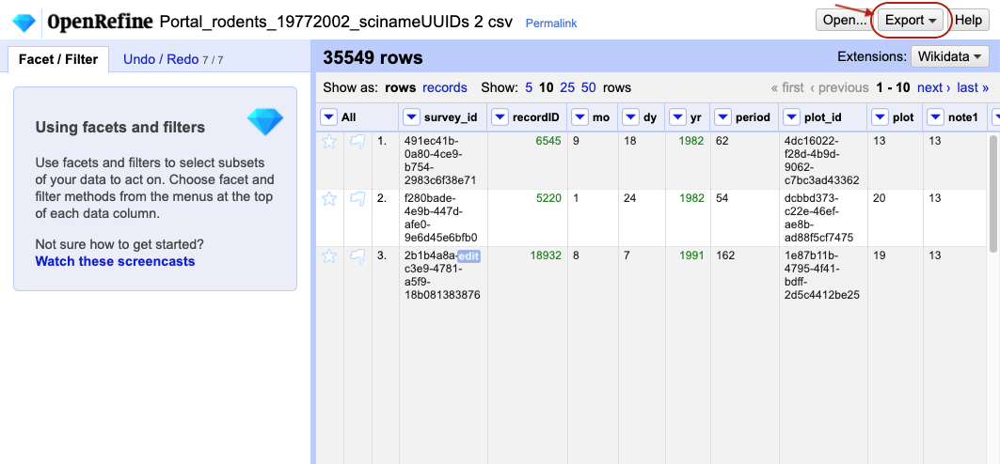
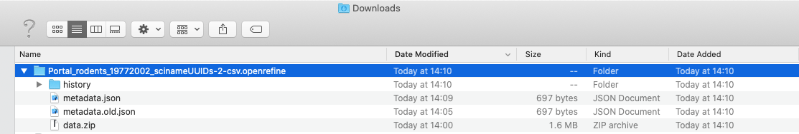
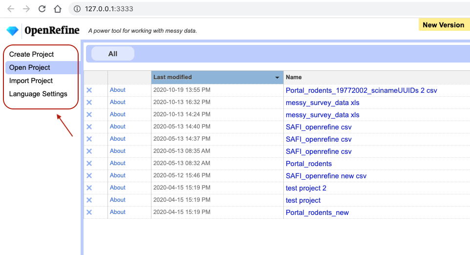

OpenRefine saves your project as you work automatically, so you don't need to worry about saving. It saves 
projects in a slightly obscure and hidden location 
(check [where OpenRefine stores project data](https://docs.openrefine.org/manual/installing#set-where-data-is-stored) for different operating systems), most likely to prevent users from accidentally tempering with them. 
You can, however, export the "OpenRefine
project" in a location of your choice, 
which will package together the data and all the information about the cleaning and data transformation steps
you've performed. You can then use the exported project to transfer your work to another computer, 
share the project with collaborators, archive it with your research, etc.

## Exporting a project
1. Click the `Export` button in the top right and select `OpenRefine project archive to file`. You might be moved to a
   new blank tab in your browser might whilst this function is executing.

    

2. A `.tar.gz` file will download to your default `Download` directory. The `tar.gz` extension tells you that this is a
   compressed file, which means that it contains multiple files (the most common version of this file type is `.zip` which
   you may be aware of).
3. You can share the `.tar.gz` file with collaborators, or copy it to a different computer and import the project back
   into OpenRefine (say, to do further work at home). Note: sharing of this type is best performed via version control
   software, such as [Git](https://southampton-rsg.github.io/swc-git-novice/index.html).

If you wish to investigate the files, you can double-click on the `tar.gz` file and it will expand into a directory
(this process can be more complicated in Windows - see below for details). A folder icon will now appear. Investigate
the files in this folder. What files appear? What information do you think they contain?

Opening a `.tar.gz` file on Windows:
* You may require additional software such as [7-zip](http://www.7-zip.org/) or
  [WinZip](http://www.winzip.com/). Download and run the installer of your choice.
* Double-click the exported `tar.gz` file. If Windows asks how you want to open the file, check the "Always use this app
  to open `.gz` files" box, then select "More apps".
* If your chosen application is not listed, select 'Look for another app on this PC'.
* In the file browser, navigate to `C:\Program Files`, find the application you installed, and double-click on its executable
    (`7zFM`, for example).

Once you open the `.tar.gz` OpenRefine project fine, you should see:
* a  `history` folder which contains three `zip` files. Each of these contains a `change.txt` file, which lists each of
  the individual transformation that you performed on your data. 
* a `data.zip` file. When expanded, this `zip` file includes a file called `data.txt` which is a copy of your raw data.
You may also see other files.

## Importing a new project
You can import an exported project into OpenRefine as follows:

1. Click `Open...` in the top-right of the screen, which will take you back to OpenRefine's main interface.
1. Select `Import Project` from the left-hand panel and, click `Choose files` and navigate to the `.tar.gz` file in the
   window that opens. Click the file and select `Open` (or just double-click the file).
1. The project will open. It include all of the raw data and the cleaning steps that were part of the original project.

## Opening an existing project
When you open OpenRefine (or navigate to `http://localhost:3333/` from an already open project), 
you will see a list of projects already saved on your machine that you have created or imported earlier. 
You can click on any one of them to open them and continue working on them in OpenRefine.

## Exporting Cleaned Data
You can also export just your cleaned
data from an OpenRefine project (as opposed to the whole project), if you wish to save it in a form more suited to 
further analysis (e.g. as CSV) and so that it can be used by other programs. For example, you might wish
to save the data into a `.csv` file so that you can conduct further analysis using Python or R.

1. Click `Export` in the top right and select the file type you want to export
    *  `Comma-separated values` (`csv`) is a good choice, because it's a file type that can be read by most other data
       analysis programs. `Tab-separated values` (`tsv`) is also a popular format.
2. The cleaned data will be exported to your default `Download` directory.

Using widely-supported, open, static and non-proprietary file formats like `.csv` or `.tsv` make it easier for yourself and others
to use your data in the future. 

