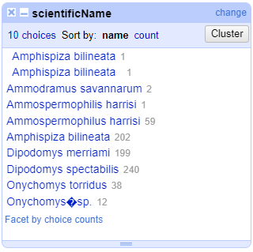
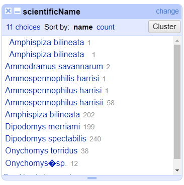
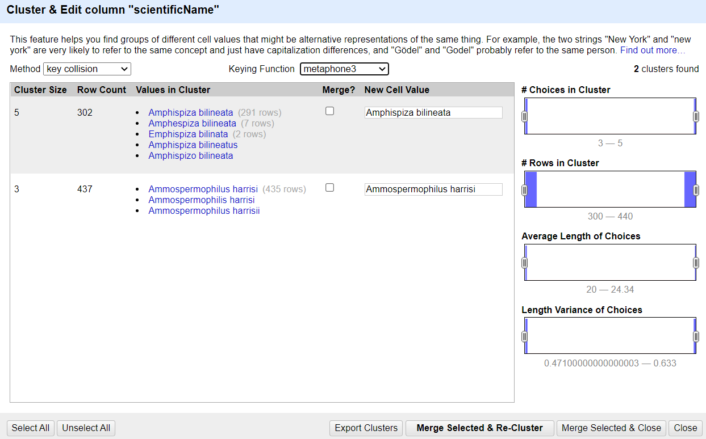
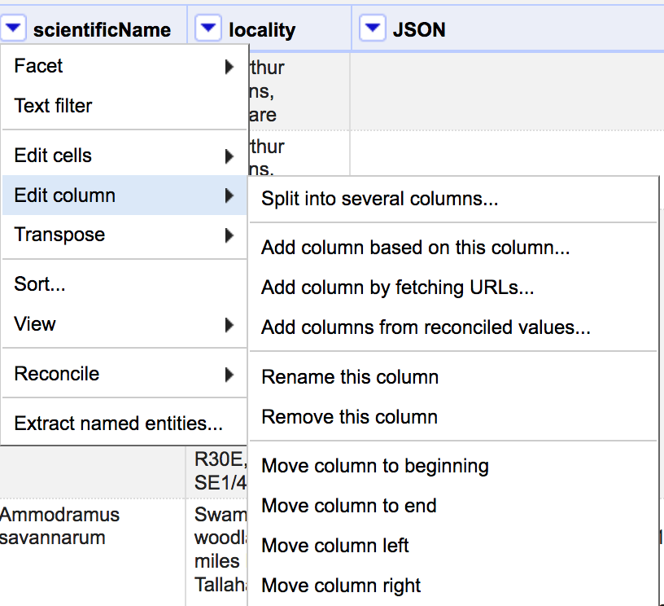
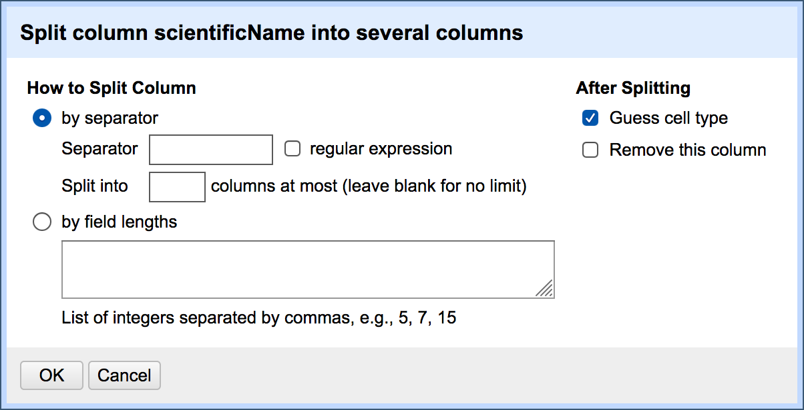
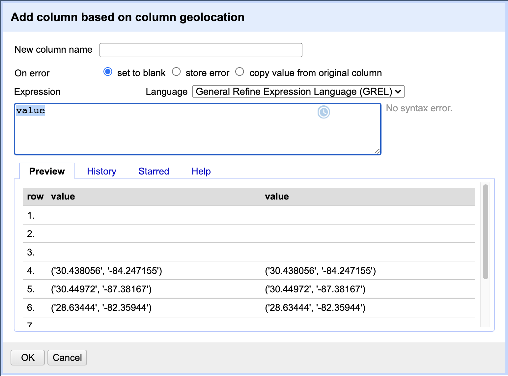
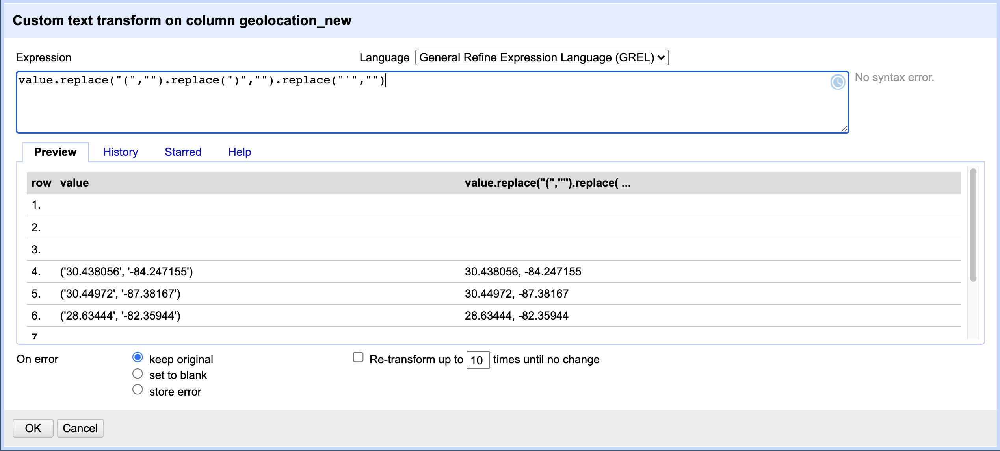
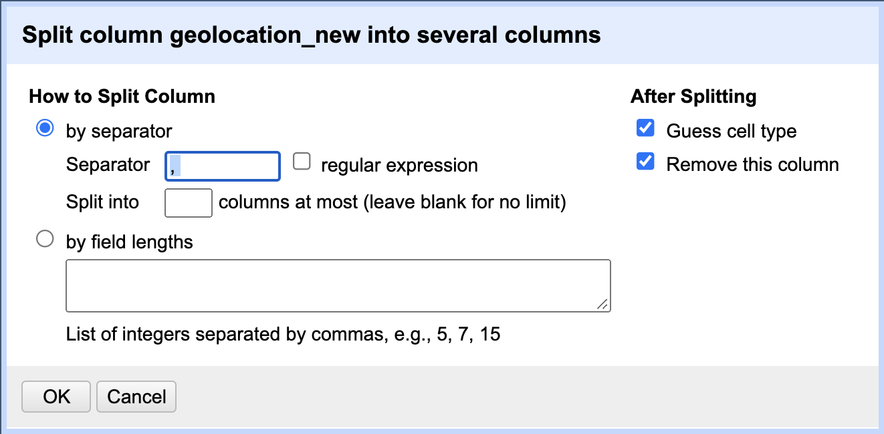

# Lesson

## Creating a Project

Start OpenRefine, which will open in your browser (at the address `http://127.0.0.0:3333`). Once OpenRefine is launched in your
browser, the left margin has options to `Create Project`, `Open Project`, or `Import Project`. Here we will create a new
project and import our portal rodents data.

1. Click `Create Project` from the left margin and select then `This Computer` (because you're uploading data from your
   computer).  
1. Click `Choose Files` and browse to where you stored the file `Portal_rodents_19772002_scinameUUIDs.csv`. Select the
   file and click `Open`, or just double-click on the filename.
1. Click `Next>>` under the browse button to upload the data into OpenRefine.  
1. On the next screen, OpenRefine will present you with a preview of your data. You can check here for obvious errors, if, for example, your file was tab-delimited rather than comma-delimited, the preview would look strange (and you
   could correct it by choosing the correct separator and clicking the `Update Preview` button on the right. If you selected the wrong file, click `<<Start Over` at the top left.

    

1. In the middle of the page, will be a set of options (`Character encoding`, etc.). Make sure the tick box next to
   `Trim leading & trailing whitespace from strings` is not ticked. (We're going to need the leading whitespace in one of our examples.)
1. If all looks well, click `Create Project>>` in the top right. You will be presented with a view onto your data. This is OpenRefine!

> ## OpenRefine does not modify your original dataset
> Once your data is imported into a project - OpenRefine leaves your raw data intact and works on a copy which it creates
> inside the newly created project. All the data transformation and cleaning steps you apply will be performed on this copy
> and you can easily undo any changes too.
{: .callout}
> ## Data file types supported
> OpenRefine can import a variety of different file types, including tab separated (`tsv`),
> comma separated (`csv`), Excel (`xls`, `xlsx`), JSON, XML, RDF as XML, and Google Spreadsheets.
> See the [OpenRefine Importers page](https://github.com/OpenRefine/OpenRefine/wiki/Importers) for more information.
{: .testimonial}
Let's now start exploring and getting a higher-level overview of our data - summarising and looking for potential
outliers and errors.

## Data Faceting

Facets are one of the most useful features of OpenRefine. Data faceting is a process of exploring data by applying multiple filters to investigate its composition. It also allows you to identify a subset of data that you wish to change in bulk.

> ## OpenRefine Wiki: Faceting
> Full documentation on faceting can be found at [OpenRefine Wiki: Faceting](https://github.com/OpenRefine/OpenRefine/wiki/Faceting)
{: .callout}

A `facet` groups all the like values that appear in a column, and allows you to filter the data by those values. It also allows you to edit values across many records at the same time.

One type of facet is called a 'Text facet'. This groups all the identical text values in a column and lists each value with the number of records it appears in. The facet information always appears in the left hand panel in the OpenRefine interface.

Here we will use faceting to look for potential errors in data entry in the `scientificName` column.

1. Scroll over to the `scientificName` column.
2. Click the down arrow and choose `Facet` > `Text facet`.

    

3. In the left panel, you'll now see a box containing every unique value in the `scientificName` column
along with a number representing how many times that value occurs in the column.

    

4. Try sorting this facet by name and by count. Do you notice any problems with the data? What are they?
5. Hover the mouse over one of the names in the `facet` list. You should see that you have an `edit` function available.
6. You could use this to fix an error immediately, and OpenRefine will ask whether you want to make the same correction to every value it finds like that one. But OpenRefine offers even better ways to find and fix these errors, which we'll use instead. We'll learn about these when we talk about clustering.

There will be several near-identical entries in `scientificName`. For example, there is one entry for `Ammospermophilis harrisi` and
one entry for `Ammospermophilus harrisii`. These are both misspellings of `Ammospermophilus harrisi`. We will see how to correct these
misspelled and mistyped entries in a later exercise.  

> ## More on Facets
>
> [OpenRefine Documentation: Exploring Facets](https://docs.openrefine.org/manual/facets)
>
> As well as 'Text facets' OpenRefine also supports a range of other types of facet. These include:
>
> * Numeric facets
> * Timeline facets (for dates)
> * Custom facets
> * Scatterplot facets
>
> **Numeric and Scatterplot facets** display graphs instead of lists of values. The numeric facet graph includes 'drag and drop' controls you can use to set a start and end range to filter the data displayed. These facets are explored further in [Examining Numbers in OpenRefine](http://www.datacarpentry.org/OpenRefine-ecology-lesson/03-numbers/)
>
> **Custom facets** are a range of different types of facets. Some of the default custom facets are:
>
> * Word facet - this breaks down text into words and counts the number of records each word appears in
> * Duplicates facet - this results in a binary facet of 'true' or 'false'. Rows appear in the 'true' facet if the value in the selected column is an exact match for a value in the same column in another row
> * Text length facet - creates a numeric facet based on the length (number of characters) of the text in each row for the selected column. This can be useful for spotting incorrect or unusual data in a field where specific lengths are expected (e.g. if the values are expected to be years, any row with a text length more than 4 for that column is likely to be incorrect)
> * Facet by blank - a binary facet of 'true' or 'false'. Rows appear in the 'true' facet if they have no data present in that column. This is useful when looking for rows missing key data.
{: .callout}

Facets are intended to group together common values and OpenRefine limits the number of values allowed in a single facet to ensure the software does not perform slowly or run out of memory. If you create a facet where there are many unique values (for example, a facet on a 'book title' column in a data set that has one row per book) the facet created will be very large and may either slow down the application, or OpenRefine will not create the facet.

> ## Exercise
>
> 1. Using faceting, find out how many years are represented in the census.  
>
> 3. Which years have the most and least observations?
>
> 2. Is the column formatted as Number, Date, or Text? How does changing the format change the faceting display?
>
> > ## Solution
> >
> > 1. For the column `yr` do `Facet` > `Text facet`. A box will appear in the left panel showing that there are 26 unique entries in
> > this column.  
> > 3. After creating a facet, click `Sort by count` in the facet box. The year with the most observations is 1997. The least is 1977.
> > 2. By default, the column `yr` is formatted as Text. You can change the format by doing `Edit cells` > `Common transforms` >
> > `To number`. Doing `Facet` > `Numeric facet` creates a box in the left panel that shows a histogram of the number of
> > entries per year. Notice that the data is shown as a number, not a date. If you instead transform the column to a date, the
> > program will assume all entries are on January 1st of the year.   
> >
> {: .solution}
{: .challenge}

## Clustering

In OpenRefine, clustering means "finding groups of different values that might be alternative representations of the same thing". For example, the two strings `New York` and `new york` are very likely to refer to the same concept and just have capitalization differences. Likewise, `Gödel` and `Godel` probably refer to the same person. Clustering is a very powerful tool for cleaning datasets which contain misspelled or mistyped entries. OpenRefine has several clustering algorithms built in. Experiment with them, and learn more about these algorithms and how they work.

1. In the `scientificName` Text facet we created in the step above, click the `Cluster` button (or select `Edit cells` > `Cluster and edit`).
2. In the resulting pop-up window, you can change the `Method` and the `Keying Function`. Try different combinations to
 see what different mergers of values are suggested.
3. Select the `key collision` method and `metaphone3` keying function. It should identify two clusters.

    

4. Click the `Merge?` box beside each, then click `Merge Selected & Re-Cluster` to apply the corrections to the dataset.
4. Try selecting different `Methods` and `Keying Functions` again, to see what new merges are suggested. You may find there are
 still improvements that can be made, but don't `Merge` again; just `Close` when you're done.  We'll now
 see other operations that will help us detect and correct the remaining problems, and that have other, more general uses.

Important: If you `Merge` using a different method or keying function, or more times than described in the instructions above,
your solutions for later exercises will not be the same as shown in those exercise solutions.

[More on clustering](https://docs.openrefine.org/next/technical-reference/clustering-in-depth)

## Split

If data in a column needs to be split into multiple columns, and the parts are separated by a common separator (say a comma, or a space), you can use that separator to divide up the pieces into their own columns.

1. Let us suppose we want to split the `scientificName` column into separate columns for genus and for species.
2. Click the down arrow at the top of the `scientificName` column. Choose `Edit column` > `Split into several columns...`

    

3. In the pop-up, in the `Separator` box, replace the comma with a space.
4. Uncheck the box that says `Remove this column`.

    

5. Click `OK`. You'll get some new columns called `scientificName 1`, `scientificName 2`, and so on.

> ## Exercise
>
> Try to change the name of the second new column to "species". How can you correct the problem you encounter?
>
> > ## Solution
> >
> > On the `scientificName 2` column, click the down arrow and then `Edit column` > `Rename this column`. Type "species" into the box
> > that appears. A pop-up will appear that says `Another column already named species`. This is because there is another column
> > where we've recorded the species abbreviation. You can choose another name like `speciesName` for this column or change the other
> > `species` column name to `speciesAbbreviation`.
> {: .solution}
{: .challenge}
## Undoing / Redoing actions

It's common while exploring and cleaning a dataset to discover after you've made a change that you really should have done something else first. OpenRefine provides `Undo` and `Redo` operations to make this easy.

1. Click where it says `Undo / Redo` on the left side of the screen. All the changes you have made so far are listed here.

    

2. Click on the step that you want to go back to, in this case the previous step. The added columns will disappear.
3. Notice that you can still click on the last step and make the columns reappear, and toggle back and forth between these states.
4. Leave the dataset in the state in which the `scientificNames` were clustered, but not yet split.

Important: `Undo` the splitting step before moving on to the next lesson. If you skip this step, your solutions for later exercises will not be the same as shown in those exercise solutions.

Important: If you skip this step, your solutions for later exercises will not be the same as shown in those exercise solutions.

## Trim Leading and Trailing Whitespace
Words with spaces at the beginning or end are particularly hard for humans to identify from strings without these
spaces (as we have seen with the `scientificName` column). However, blank spaces can make a big difference to computers, so we usually want to remove them.

1. In the header for the column `scientificName`, choose `Edit cells` > `Common transforms` > `Trim leading and trailing whitespace`.
2. Notice that the `Split` step has now disappeared from the `Undo / Redo` pane on the left and is replaced with a `Text transform on 3 cells`
3. Perform the same `Split` operation on `scientificName` that you undid earlier. This time you should now only get two new columns.

Removing the leading white spaces means that each entry in this column has exactly one space
(between the genus and species parts of the original `scientificName` data).
Therefore, when you now split with space as the separator, you should get only two columns. Let's do this as an exercise.

> ## Exercise
> Repeat the splitting of column `scientificName` exercise.
> > ## Solution
> >
> > On the `scientificName` column, click the down arrow next to the `scientificName` column and
> > choose `Edit Column` > `Split into several columns...` from the drop down menu. Use a blank character as a separator,
> > as before. You should now get only two columns `scientificName 1` and `scientificName 2`.
> {: .solution}
{: .challenge}

## Transforming Data Using GREL

OpenRefine provides a way to write special expressions to accomplish more complex data transformations
(such as string manipulation or mathematical calculations) to improve the structure of the data.
These functions are written in a special language called [GREL](https://docs.openrefine.org/manual/grel) (General Refine Expression Language). GREL can be used in several places:
1. when transforming cells in a column using the transformation function
2. when adding a column based on another column
3. when creating a custom Text or Numeric facet
4. when creating a new column by fetching data from a URL

We will have a look at the first two of these options; you can explore other yourself - the
principle of using GREL will be the same and all GREL input windows in OpenRefine will have a
very similar outlook.

Let's have a look at the column `geolocation` - it contains latitude and longitude coordinates of locations
where observations took place combined together like this: `('30.438056', '-84.247155')`. As can be noted, data contains
round braces "(" and ")" and single quotes "'" around data making it less useful for any processing.
We want to get rid of all these characters and split the data in two columns to contain individual values
for latitude and
longitude.

1. First we want to create a duplicate of the `geolocation` column where we will perform our operations and keep
the original `geolocation` intact. To do so, on the `geolocation` column click the down arrow and then
`Edit column` > `Add column based on this column...`.
2. You will be presented with a window to enter a GREL expression telling OpenRefine how to transform the current data
when creating a new column based off it.

   

   GREL `Expression` field contains the expression "value" to begin with. This indicates to use
   the current "value" of the cell as is when transforming data. In the Preview panel below you can also
   see the current cell value and what the new value would be after applying the GREL expression to it (in this case -
   both values will be the same as we are simply duplicating the column). In the `New column name` field type the new
   new name for our duplicate column, e.g. `geolocation_new`. When finished, click `OK` to apply the action.
3. After OpenRefine creates the `geolocation_new` column, we want to do further transformations
   on it to extract longitude and latitude values. To do so, select
   `Edit cells` > `Transform...` from the drop down menu on the `geolocation_new` column. You will once again be
   presented with a similar
   window to enter a GREL expression. This time, we want to chain a few functions in the GREL expression
   to achieve the desired effect of removing round braces and single quotes,
   like so: `value.replace("(","").replace(")","").replace("'","")`.
   We are replacing any occurrence of "(" in the cell data value with a blank character (effectively deleting it), and
   then repeating (chaining) similar functions on the output value from the previous function until we remove all
   unwanted characters. Try typing one function at a time to see what effect it has on the data - you can
   see the result of applying each expression in the Preview panel.

   

   When finished, click `OK` to apply the data transformation.
4. We are now ready to split the `geolocation_new` column using the `Edit Column` > `Split into several columns...`,
   as we learned earlier in this episode. The separator we want to use in this case is ", " - a comma followed by a blank
   character. If, in addition, you select the `Guess cell type` checkbox in the split column popup window,
   OpenRefine will correctly identify that the values in new columns are numeric and
   transform the data type for us as well.

   

5. You should now have 2 new columns with numeric data named `geolocation_new 1` and `geolocation_new 2`
   representing the extracted longitude and latitude values respectively.
6. Rename your new columns to `longitude` and `latitude` accordingly. You can now make further use of the extracted data from
other applications, e.g. plot geolocations on a map.

GREL offers [rich syntax and a large number of functions](https://docs.openrefine.org/manual/grelfunctions)
for complex string manipulations (and handling different text formats - JSON, HTML, XML),
working with numbers, dates and boolean (TRUE/FALSE) values, logical and mathematical operations. We
strongly recommend learning more on GREL syntax and functionalities.

> ## GREL documentation
> Check the [official GREL documentation](https://docs.openrefine.org/manual/grel) for the full reference on GREL.
> Here is [another useful GREL guide](https://guides.library.illinois.edu/openrefine/grel) to check out.
{: .callout}
