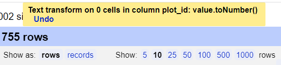
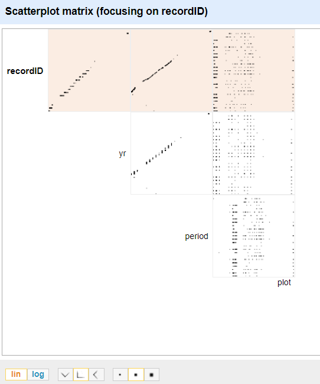

## Exploring data with facets

Facets are one of the most useful features of OpenRefine. Data faceting is a process of exploring data by applying multiple filters to investigate its composition. It also allows you to identify a subset of data that you wish to change in bulk.

A `facet` groups all the like values that appear in a column, and allows you to filter the data by those values. It also allows you to edit values across many records at the same time.

### Exploring text columns

One type of facet is called a 'Text facet'. This groups all the identical text values in a column and lists each value with the number of records it appears in. The facet information always appears in the left hand panel in the OpenRefine interface.

Here we will use faceting to look for potential errors in data entry in the `scientificName` column.

1. Scroll over to the `scientificName` column.
2. Click the down arrow and choose `Facet` > `Text facet`.

    

3. In the left panel, you'll now see a box containing every unique value in the `scientificName` column
along with a number representing how many times that value occurs in the column.

    

4. Try sorting this facet by name and by count. Do you notice any problems with the data? What are they?
5. Hover the mouse over one of the names in the `facet` list. You should see that you have an `edit` function available.
6. You could use this to fix an error immediately, and OpenRefine will ask whether you want to make the same correction to every value it finds like that one. But OpenRefine offers even better ways to find and fix these errors, which we'll use instead. We'll learn about these when we talk about clustering.

>## Facets and large datasets
Facets are intended to group together common values and OpenRefine limits the number of values allowed in a single facet to ensure the software does not perform slowly or run out of memory. If you create a facet where there are many unique values (for example, a facet on a 'book title' column in a data set that has one row per book) the facet created will be very large and may either slow down the application, or OpenRefine will not create the facet.
{: .callout}

> ## Exercise
>
> 1. Using faceting, find out how many years are represented in the census.  
> 1. Which years have the most and least observations?
> 1. Is the column formatted as Number, Date, or Text?
>
> > ## Solution
> >
> > 1. For the column `yr` do `Facet` > `Text facet`. A box will appear in the left panel showing that there are 16 unique entries in this column.
> > 1. After creating a facet, click `Sort by count` in the facet box. The year with the most observations is 1978. The least is 1993.
> > 1. By default, the column `yr` is formatted as Text.
> >
> {: .solution}
{: .challenge}

### Exploring numeric columns

When a table is imported into OpenRefine, all columns are treated as having text values. We saw earlier how we can sort column values as numbers, but this does not change the cells in a column from text to numbers. Rather, this interprets the values as numbers for the purposes of sorting but keeps the underlying data type as is. We can, however, transform columns to other data types (e.g. number or date) using the `Edit cells` > `Common transforms` feature. Here we will experiment changing columns to numbers and see what additional capabilities that grants us.

#### Numeric facet

Sometimes there are non-number values or blanks in a column which may represent errors in data entry and we want to find them. We can do that with a `Numeric facet`.

To transform cells in the `yr` column to numbers, click the down arrow for that column, then `Edit cells` > `Common transforms…` > `To number`. You will notice the `yr` values change from left-justified to right-justified, and black to green color.

> ## Exercise
>
> Transform the columns `period`, `plot`, `recordID`, and `plot_id` from text to numbers.
>
> 1. How does changing the format change the faceting display for the `yr` column?
> 1. Can all columns be transformed to numbers?
>
> > ## Solution
> >
> > Displaying a `Numeric facet` of `yr` shows a histogram of the number of
> > entries per year. Notice that the data is shown as a number, not a date. If you instead transform the column to a date, the program will assume all entries are on January 1st of the year.   
> >
> > Only observations that include only numerals (0-9) can be transformed to numbers. If you apply a number transformation to
> > a column that doesn't meet this criteria, in this case `plot_id` you will see a message at the top that starts with `Text transform on 0 cells...`.
> >
> >   
> >
> > This means that the data in that column was not transformed.
> >
> {: .solution}
{: .challenge}

The next exercise will explore what happens when a numeric column contains values that are not numbers.

> ## Exercise
>
> 1. For a column you transformed to numbers, edit one or two cells, replacing the numbers with text (such as `abc`) or blank (no number or text).
> 2. Use the pulldown menu to apply a numeric facet to the column you edited. The facet will appear in the left panel.
> 3. Notice that there are several checkboxes in this facet: `Numeric`, `Non-numeric`, `Blank`, and `Error`. Below these are counts of the number of cells in each category. You should see checks for `Non-numeric` and `Blank` if you changed some values.
> 4. Experiment with checking or unchecking these boxes to select subsets of your data.
{: .challenge}

When done examining the numeric data, remove this facet by clicking the `x` in the upper left corner of its panel. Note that this does not undo the edits you made to the cells in this column.

#### Examine a pair of numeric columns using scatterplots

Now that we have multiple columns representing numbers, we can see how they relate to one another using the scatterplot facet. Select a numeric column, for example `recordID`, and use the pulldown menu to > `Facet` > `Scatterplot facet`. A new window called `Scatterplot Matrix` will appear. There are squares for each pair of numeric columns organized in an upper right triangle. Each square has little dots for the cell values from each row.

    

> ## Exercise
>
> 1. Examine the scatterplots overall. Do the patterns make sense?
> 2. Why does the scatterplot for `recordID` vs `period` have the pattern it does?
{: .challenge}

> ## Exercise
>
> Click in the scatterplot facet in the left margin and drag to highlight a rectangle. This will subset the data to those entries.
{: .challenge}

> ## More Details on Faceting
> Full documentation on faceting can be found at [Exploring facets: Faceting](https://docs.openrefine.org/manual/facets)
{: .callout}
